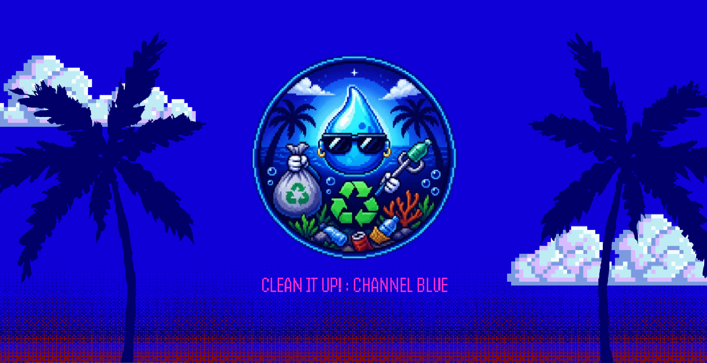
# 🌊 Clean It Up! : Channel Blue


[](LICENSE)

🕹️ **[Play now in your browser](https://gd.games/kayozkx/clean-it-up)**

A 2D top-down educational game built with GDevelop 5.

## 📥 Download

[](https://github.com/kayozkx/Channel-Blue/releases/latest)

---

## 📋 Table of Contents

- [About the Game](#-about-the-game)
- [How to Play](#-how-to-play)
- [Repository Structure](#-repository-structure)
- [Controls](#️-controls)
- [Characters and Objects](#-characters-and-objects)
- [Stage Comparison](#-stage-comparison)
- [Extensions Used](#-extensions-used)
- [Part 1 — The Beginning of the Mission](#-part-1--the-beginning-of-the-mission)
  - [Scene 1 — Intro](#-scene-1--intro)
  - [Scene 2 — Main Menu](#-scene-2--main-menu)
  - [Scene 3 — Stage 1 Transition](#-scene-3--stage-1-transition)
  - [Scene 4 — Stage 1: Lake](#️-scene-4--stage-1-lake--forgotten-waters)
  - [Scene 5 — Game Over 1](#-scene-5--game-over-1)
- [Part 2 — The Current](#-part-2--the-current)
  - [Scene 6 — Stage 2 Transition](#-scene-6--stage-2-transition)
  - [Scene 7 — Stage 2: River](#-scene-7--stage-2-river--dirty-current)
  - [Scene 8 — Game Over 2](#-scene-8--game-over-2)
- [Part 3 — The Abyss](#-part-3--the-abyss)
  - [Scene 9 — Stage 3 Transition](#-scene-9--stage-3-transition)
  - [Scene 10 — Stage 3: Sea](#-scene-10--stage-3-sea--plastic-abyss)
  - [Scene 11 — Game Over 3](#-scene-11--game-over-3)
  - [Scene 12 — Victory](#-scene-12--victory)
- [Credits](#-credits)
- [What I Learned](#-what-i-learned)
- [Challenges Faced](#️-challenges-faced)
- [Project Results](#-project-results)
- [Inspirations](#-inspirations)
- [Author](#-author)

---

## 🎮 About the Game

Channel Blue is a water spirit who travels through three aquatic ecosystems, collecting trash and facing predators corrupted by pollution. The goal is to restore the environmental balance of each ecosystem, stage by stage.

**Genre:** Action / Educational / Top-Down
**Platform:** PC (Windows) and Mobile (Android)
**Engine:** GDevelop 5
**Playtime:** ~15 minutes (3 stages, ~5 min each)

---

## 🎯 How to Play

1. Move Channel Blue through the scenario using the arrow keys or the virtual joystick.
2. Collect the trash that flows through the ecosystem.
3. Avoid obstacles and predators — each collision costs a life.
4. Reach the collection goal before time runs out.
5. Restore all three ecosystems to win.

---

## 📂 Repository Structure

```

channel-blue/
│
├── assets/
│   ├── cenas/
│   │
│   ├── eventos/
│   │   ├── fase1/
│   │   ├── fase2/
│   │   ├── fase3/
│   │   ├── fimdejogo1/
│   │   ├── fimdejogo2/
│   │   ├── fimdejogo3/
│   │   ├── intro/
│   │   ├── menu/
│   │   ├── transicao1/
│   │   ├── transicao2/
│   │   ├── transicao3/
│   │   └── vitoria/
│   │
│   ├── gameplay/
│   │
│   └── objetos/
│
├── LICENSE
└── README.md

```
> Note: internal folder names are kept in Portuguese (the original development language), but every concept is explained in English below.

---

## 🕹️ Controls

### PC
| Key | Action |
|-----|--------|
| ↑ / W | Move up |
| ← / A | Move left |
| ↓ / S | Move down |
| → / D | Move right |

### Mobile
The game supports an on-screen virtual joystick, letting you play directly from your phone's browser on [GD.games](https://gd.games/kayozkx/clean-it-up).

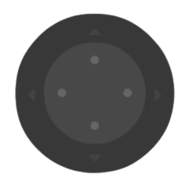

---

## 🎭 Characters and Objects

### 💧 Channel Blue — Protagonist

The guardian spirit of the waters. Controlled by the player, it travels through the three ecosystems collecting trash while dodging obstacles and predators. Has 5 directional animations: idle, up, down, right, and left.

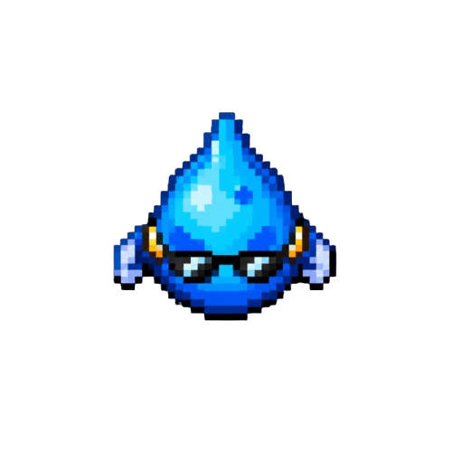

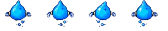
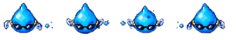
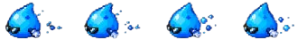
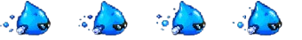

---

### 🗑️ Trash

Collectible items that flow through the scenario. Each stage features different types of waste representing real pollution found in these ecosystems.

| Stage | Trash Types |
|-------|-------------|
| Stage 1 — Lake | Plastic bottles, cans, plastic bags, packaging, glass bottles |
| Stage 2 — River | Styrofoam, diapers, PVC pipes, plastic bags, tires, glass bottles |
| Stage 3 — Sea | Barrels, packaging, straws, large plastic bottles, glass bottles |

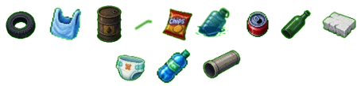

---

### 🚧 Obstacles

Elements that damage the player on collision. In Stages 2 and 3, nearby obstacles (under 400px) actively chase the player.

| Stage | Obstacle Types |
|-------|-----------------|
| Stage 1 — Lake | Rocks, floating logs, snakes, piranhas |
| Stage 2 — River | River rocks, long logs, whirlpools, alligators |
| Stage 3 — Sea | Naval mines, stingrays, jellyfish |

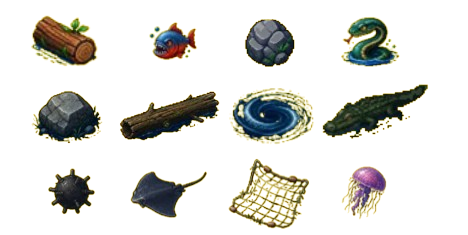

---

### 🐊 Alligator — Stage 1 Predator

The lake's predator. Actively chases the player at 120px/s. Has a 3-second immunity window between hits. Sprite flips depending on the player's direction.
Larger size: 75x50px

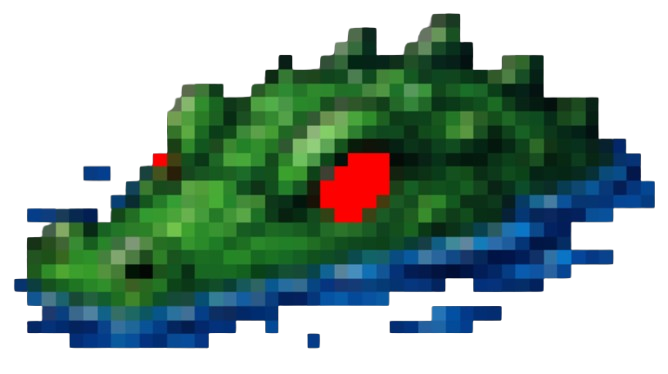

---

### 🐍 Water Snake — Stage 2 Predator

The river's predator. Faster than the Alligator, chasing at 140px/s. Same immunity and sprite-flipping system. Represents the ecological imbalance caused by pollution. Larger size: 80x55px

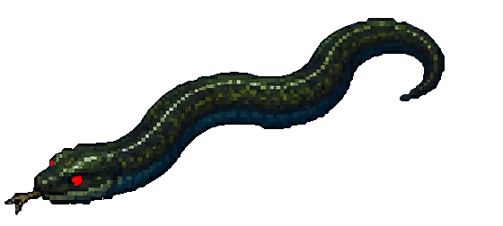

---

### 🦈 Shark — Stage 3 Predator

The most dangerous predator in the game. Chases at 160px/s. Same immunity and sprite-flipping system. Larger size: 150x100px.

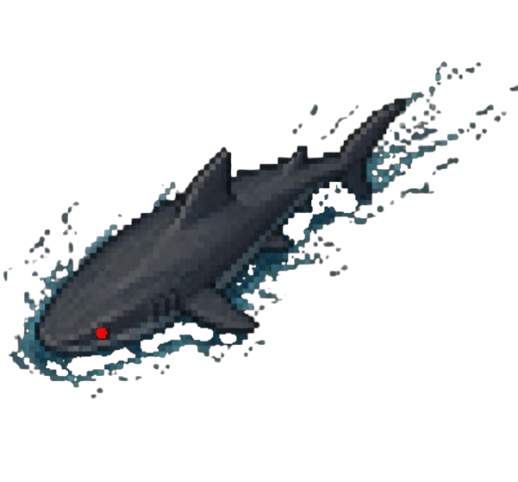

---

### 📊 Interface — HUD

Text displayed during gameplay across all stages:

| Element | Position | Function |
|---------|----------|----------|
| Timer | Top-left corner | Remaining time in seconds |
| Lives | Top-left corner | Remaining lives |
| Goal | Top-left corner | Trash collected / Total required |

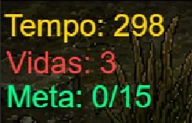  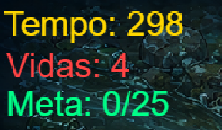  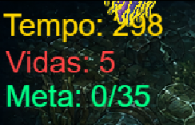

---

## 📊 Stage Comparison

| Parameter | Stage 1 — Lake | Stage 2 — River | Stage 3 — Sea |
|-----------|-----------------|-------------------|------------------|
| Trash Goal | 15 items | 25 items | 35 items |
| Lives | 3 | 4 | 5 |
| Trash Speed | 80 px/s | 100 px/s | 120 px/s |
| Obstacle Speed | 60 px/s | 110 px/s | 120 px/s |
| Trash Spawn Rate | every 2s | every 1s | every 0.8s |
| Obstacle Spawn Rate | every 3s | every 2s | every 2s |
| Current | ❌ | ✅ 125px/s | ✅ 140px/s |
| Chasing Obstacles | ❌ | ✅ | ✅ |
| Predator | Alligator | Water Snake | Shark |
| Predator Speed | 120 px/s | 140 px/s | 160 px/s |
| Predator Persists | ✅ | ✅ | ✅ |

---

## 🧩 Extensions Used

| Extension | Function |
|-----------|----------|
| TopDownMovementAnimator | Character directional animations |
| TopDownCornerSliding | Smooth corner sliding |
| BehaviorRemapper | Control remapping |
| SpriteMultitouchJoystick | Virtual joystick for mobile play |
| Gamepads | External controller support |

---

# 📖 Part 1 — The Beginning of the Mission

---

## 🎬 Scene 1 — Intro

The game's first screen. Shows a sequence of 3 animated slides before automatically moving to the Main Menu.

---

## 🏠 Scene 2 — Main Menu

Starting screen with ambient music and a Play button. A 1-second delay (`DelayMenu`) prevents an accidental click from the previous scene from skipping ahead immediately.

### Event Group: Main Menu

---

## 📜 Scene 3 — Stage 1 Transition

Shows 3 narrative slides telling Channel Blue's story and introducing the controls before entering Stage 1. Each slide is timed via `Timecontrole1`.


---

## 🏞️ Scene 4 — Stage 1: Lake — Forgotten Waters

The player begins their journey in a polluted, forgotten lake. Goal: collect 15 pieces of trash within 300 seconds, with 3 lives. Predator: Alligator (120px/s). No current.

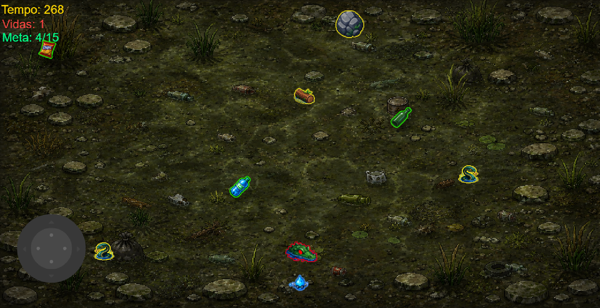

### 🎥 Gameplay


### 🔵 Initialization

Sets all initial variables: score, lives, trash collected, goal, stage-finished flag, remaining time. Starts all timers and the music. Keeps the player within the screen boundaries.

---

### 🟡 Timer

Calculates and displays remaining time by subtracting elapsed time from 300 seconds, using `TimerElapsedTime`.

---

### 🟢 Spawn

Spawns trash every 2 seconds and obstacles every 3 seconds at random positions at the top of the screen, with a constant downward force.

---

### ⚫ Screen Cleanup

Removes trash (Y≥723) and obstacles (Y≥780) that go past the bottom screen boundary.

---

### 🔴 Collisions

Collision with trash: +1 toward the goal = +1 trash collected, plays a sound effect. Collision with obstacle: -1 life, obstacle deleted. If lives reach 0: Game Over.

---

### 🟠 Stage Transition

Upon reaching the 15-trash goal: background changes to a clean lake, objects are removed, a transition timer starts, and after 3 seconds the game moves to Stage 2. If time runs out: Game Over.

---

### 🟣 Predator — Alligator

Actively chases the player with 120px/s force. Has a 3-second immunity window between hits. Sprite flips according to the player's direction.

---

## 💀 Scene 5 — Game Over 1

Shown when the player loses all lives or runs out of time in Stage 1. Has two buttons:
- **Restart** → goes directly back to Stage 1
- **Menu** → returns to the Main Menu

---

# 📖 Part 2 — The Current

---

## 📜 Scene 6 — Stage 2 Transition

Shows the presentation screen for Stage 2, titled "River: Dirty Current," before the stage begins. 3-second timer.

---

## 🌊 Scene 7 — Stage 2: River — Dirty Current

Increased difficulty with faster trash and obstacles. New mechanic: a constant 120px/s current pushes the player to the right. Goal: 25 trash items. Predator: Water Snake (140px/s).

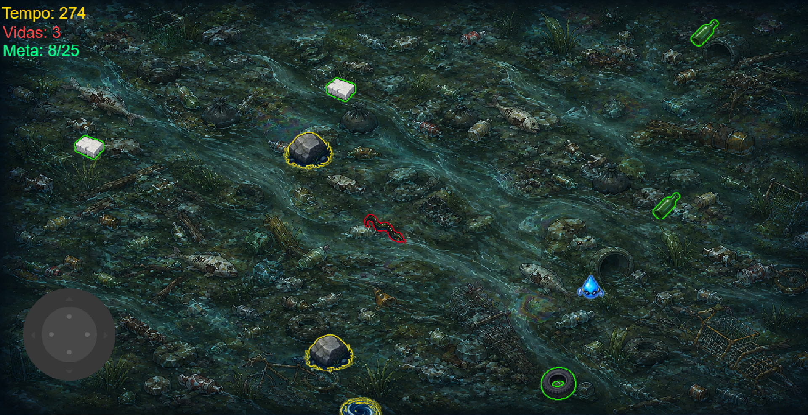

### 🎥 Gameplay


### 🔵 Initialization 2

Same structure as Stage 1 with different values: 4 lives, goal of 25, higher speeds. Adds the current timer and the Water Snake spawn.


---

### 🟡 Timer 2

Same system as Stage 1 — displays remaining time in seconds.


---

### 🟢 Spawn 2

Trash spawns every 1 second at 100px/s. Obstacles every 2 seconds. The current applies a constant force of 125px/s at 0° (rightward) on the player.


---

### ⚫ Screen Cleanup 2

Removes trash (Y≥723) and obstacles (Y≥780).


---

### 🔴 Collisions 2

Same logic as Stage 1. Goal display updated to "/25". Obstacles within 400px of the player start chasing them.


---

### 🟠 Stage Transition 2

Upon reaching 25 trash items: background changes to a clean river, the snake and objects are deleted, and the game moves to the Stage 3 transition after 3 seconds.


---

### 🟣 Predator — Water Snake

Chases at 140px/s — faster than the Alligator. Same immunity and sprite-flipping system.


---

## 💀 Scene 8 — Game Over 2

Shown when the player loses all lives or runs out of time in Stage 2. Has two buttons:
- **Restart** → goes directly back to Stage 2
- **Menu** → returns to the Main Menu


### Event Group: Game Over 2


---

# 📖 Part 3 — The Abyss

---

## 📜 Scene 9 — Stage 3 Transition

Shows the presentation screen for Stage 3, titled "Sea: Plastic Abyss." 3-second timer.

---

## 🌐 Scene 10 — Stage 3: Sea — Plastic Abyss

The hardest stage. Trash and obstacles at maximum speed (120px/s), a sea current, chasing obstacles, and a Shark that persists on screen. Goal: 35 trash items.

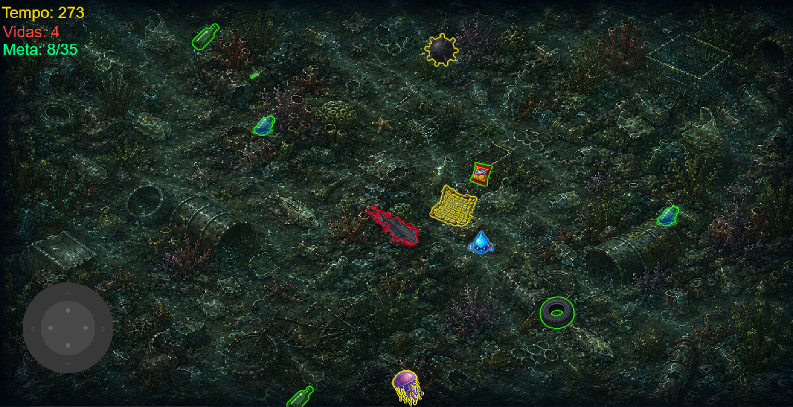

### 🎥 Gameplay


### 🔵 Initialization 3

Goal of 35 trash items, epic music. Adds the Shark timer. Identical structure to previous stages, with maximum values.

---

### 🟡 Timer 3

Same system as the previous stages.


---

### 🟢 Spawn 3

Trash every 0.8 seconds at 100px/s. Obstacles every 2 seconds at 100px/s. Current at 140px/s. All obstacles within 400px chase the player.


---

### ⚫ Screen Cleanup 3

Removes trash (Y≥723) and obstacles (Y≥780).


---

### 🔴 Collisions 3

Same logic. Goal display updated to "/35".


---

### 🟠 Stage Transition 3

Upon reaching 35 trash items: background changes to a clean ocean, and after 3 seconds the game moves to the Victory screen.


---

### 🟣 Predator — Shark

The most dangerous predator. 160px/s, persists on screen as a constant threat. Size 150x100px. Same immunity and sprite-flipping system.


---

## 💀 Scene 11 — Game Over 3

Shown when the player loses all lives or runs out of time in Stage 3. Has two buttons:
- **Restart** → goes directly back to Stage 3
- **Menu** → returns to the Main Menu

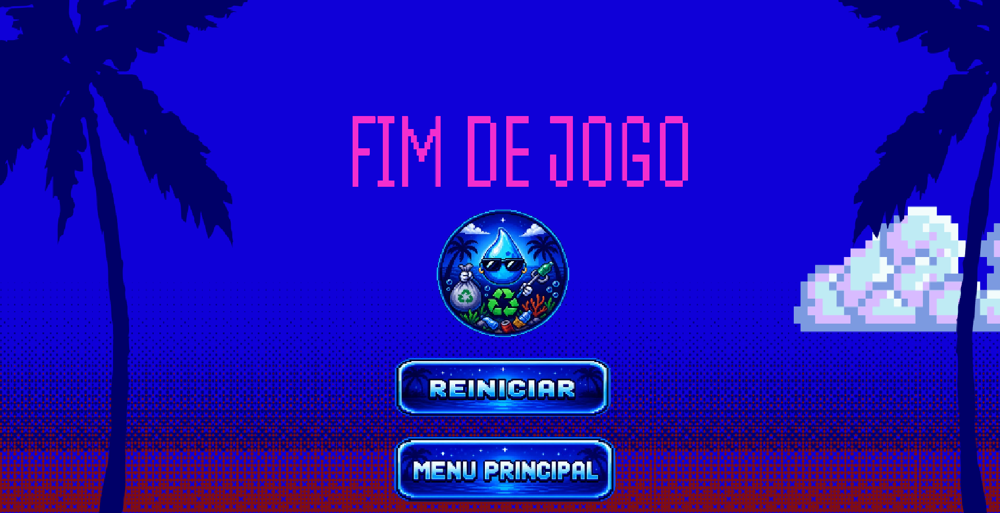

---

## 🏆 Scene 12 — Victory

Final screen shown after completing all 3 stages. Two timed celebration slides with triumphant music. After 11 seconds, shows the final screen with the logo and a button to return to the Menu.

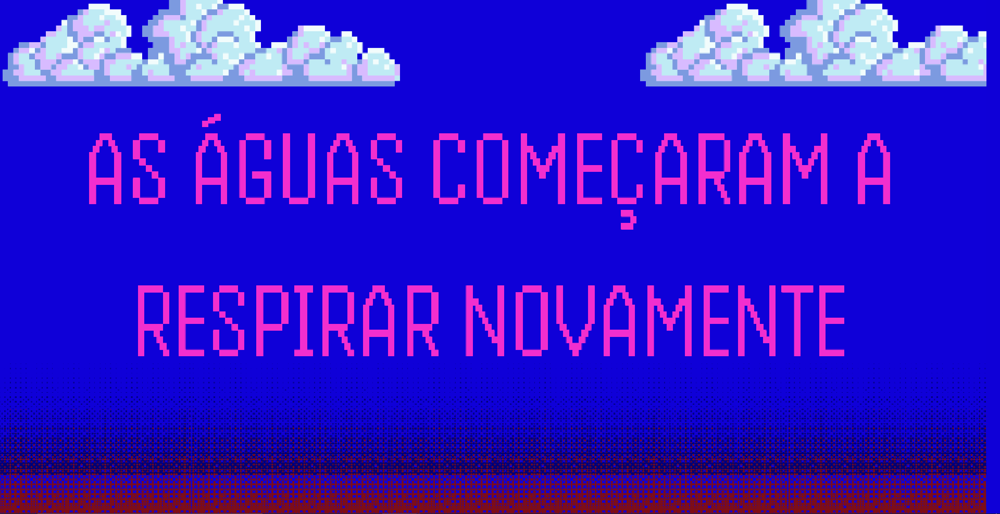
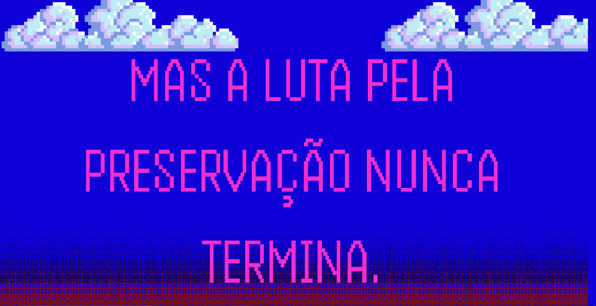
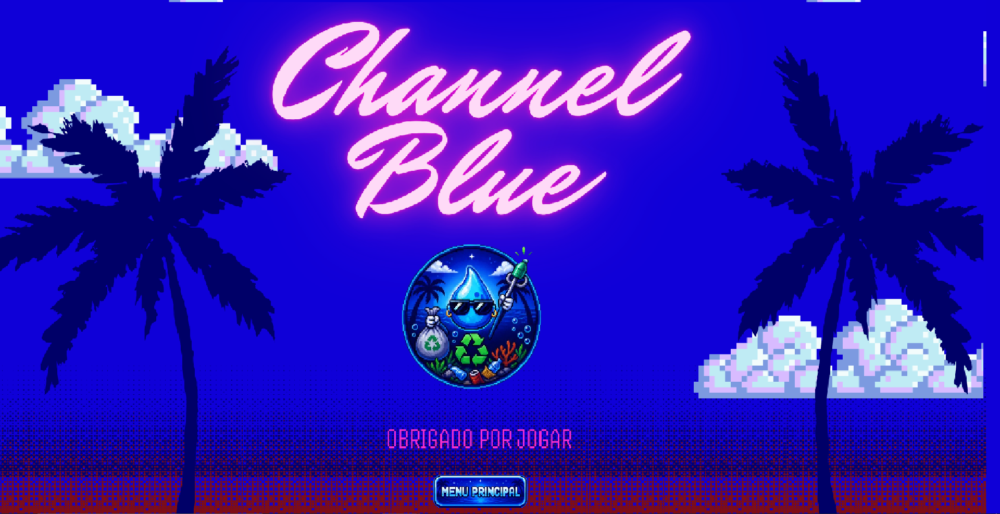

### Event Group: Victory

---

## 🎨 Credits

| Resource | Tool | Use |
|----------|------|-----|
| Sprites and backgrounds | ChatGPT (DALL-E) | Characters, objects, and backgrounds |
| Interfaces | Canva Magic Media | HUD and menus |
| Music | Suno.ai | Soundtrack |
| Sound effects | Freesound.org | Gameplay sounds |
| Engine and visual tools | GDevelop 5 | Development, events, logic, and game publishing |

---

## 📚 What I Learned

- Structuring games into scenes and events in GDevelop
- Building stage systems with progressive difficulty
- Developing 2D top-down games
- Designing interfaces and HUDs for games
- Publishing games for PC and Mobile

---

## ⚔️ Challenges Faced

- Implementing the predator-chasing system without freezing the game
- Balancing progressive difficulty across the three stages
- Adapting controls to work well on both PC and mobile
- Optimizing object spawning to avoid performance overload

---

## 📊 Project Results

| Metric | Result |
|--------|--------|
| Scenes developed | 12 |
| Playable stages | 3 |
| Playtime | ~15 minutes |
| Platforms | PC and Mobile |
| Published on | [GD.games](https://gd.games/kayozkx/clean-it-up) |

**Implemented systems:**
- ✅ Trash collection with per-stage goals
- ✅ Lives system
- ✅ Countdown timer
- ✅ Predators with chasing AI
- ✅ Current (Stages 2 and 3)
- ✅ Virtual joystick for Mobile
- ✅ Intro, transition, and victory screens

---

## 💡 Inspirations

- The name "Channel Blue" was inspired by Frank Ocean's album "Channel Orange"
- The connection between the artist's name "Ocean" and the game's aquatic ecosystems made the reference feel even more natural
- I had always wanted to make a game, and this project was my first chance to make that happen
- Concern about pollution in aquatic ecosystems around the world
- A desire to create something accessible and fun
- A wish to combine entertainment with environmental awareness in a single experience
- Curiosity about building a game from scratch using modern tools

---

## 👤 Author

Developed by **Kayozkx**

---

> A project focused on environmental education and the preservation of aquatic ecosystems.

> Development started — May 26, 2026.
